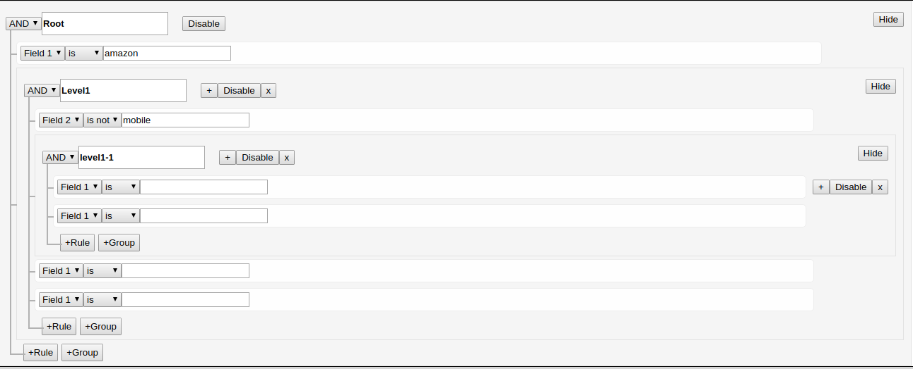

# Query Generator Component

Note: This code is taken from [react-querybuilder](https://github.com/sapientglobalmarkets/react-querybuilder).

- This component can be use to generate **`complex query ui`**.
- This component has two main component `Rules` and `Groups`. Rule is the basic entity and A Group is the collection of rules.
- A Rule includes 3 things: `Field, Operator and Value`.
- A `Group` include `multiple Rules` with the Group Label.
- Some of the operations like _`Enable, Disable, Minimizing, Maximizing and Delete`_ can be done at any level(`Rule & Group`).

Sample UI



Eample of using Query Generator Tree

```.js
      <QueryGenerator />
```

# How to Use

Sample component

```.js
<QueryGenerator
    fields={fields}
    combinators={combinators}
    getOperators={getOperators}
    query={query}
    onQueryChange={(query, event, arg) => console.log('This is Query Change Handler', query, event, arg)}
    controlClassnames={controlClassnames}
    onClearQueryTree={() => console.log('This is Clear Query Tree Handler')}
    editable={this.props.editable}
/>
```

- For Changing Fields pass a list of field object in the below format.

For Example

```.js
export const fields = [
  { name: 'field1', label: 'Field1' },
  { name: 'field2', label: 'Field2' },
  // ...
]
```

- For Changing Combinators

```.js
[
  { name: 'and', label: 'ALL OF ' },
  { name: 'or', label: 'ANY OF ' },
  // ...
]
```

- For Changing Operators pass a list of operator object in the below format.

For Example

```.js
const fieldOperators = {
    field1: [
      { name: 'contains', label: 'contains' },
      { name: 'notContains', label: 'not contains' }
    ],
    field2: [
        { name: 'eq', label: '=' },
        { name: 'neq', label: '!=' }
    ]
    // ...
}


const getOperators = (fieldName) => {
  return fieldOperators[fieldName]
}
```

- For changing class style

```.js
{
  queryBuilder: '', // Root <div> element
  combinators: '', // <select> control for combinators
  removeGroup: '', // <button> to remove a RuleGroup
  fields: '', // <select> control for fields
  operators: '', // <select> control for operators
  value: '', // <input> for the field value
  removeRule: '', // <button> to remove a Rule
  disableToggle: '',
  emptyQueryTree: '', // <button> to clear query tree
  repeatRule: ''
}
```

- Sample Default Query Example

```.js
{
  combinator: 'and',
  id: 'g-default',
  ruleGroupLabel: ''
  rules: [
    {
      field: 'field1',
      id: 'r-default',
      operator: 'is',
      value: ''
    }
  ]
}
```

- By Default editable property is true, for read only mode make it false.
